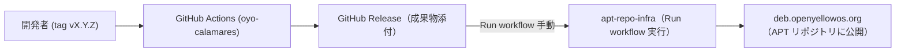

# oyo-calamares

`oyo-calamares` は、**GNOME の外観（UI）プリセットをワンクリックで適用**するためのユーティリティ（Debian パッケージ）です。  
`dconf` を用いて各種 GNOME Shell 拡張機能の設定・有効化を行い、**oYo Original / Windows Style / Mac Style** の 3 プロファイルを切り替えます。  
UI 選択には `zenity` を使用した簡易 GUI を提供します。

---

## リポジトリ構成

- `debian/` : Debian パッケージのメタデータ  
- `usr/bin/oyo-calamares` : 実行スクリプト本体  
- `.github/workflows/release.yml` : CI/CD ワークフロー定義  

---

## クライアントPCからの取得方法

oYoのリポジトリからインストール可能です。

```bash
sudo apt update
sudo apt install oyo-calamares
```
---

## CI/CD の仕組み（開発者向け）

`oyo-calamares` の開発では GitHub Actions を利用した CI/CD を導入しています。  
修正内容を push → tag を付与 → GitHub Actions で自動ビルド → `apt-repo-infra` でリポジトリ公開、という流れです。 



### フロー概要

1. **ソースコード修正**
   ```bash
   git clone https://github.com/openyellowos/oyo-calamares.git
   cd oyo-calamares
   ```

2. **プログラム修正**
   - `oyo-calamares` 配下を編集する。  
   - 必要があれば README.md も修正する。  

3. **changelog 更新**
   ```bash
   debchange -i
   ```
   - changelog に修正内容を記入する。

   例:
   ```text
   calamares (3.3.14.oyo1) UNRELEASED; urgency=medium

     * oYo patchset (keyboard layout behavior, etc.)

    -- toshio <toshio@oYo>  Wed, 18 Feb 2026 22:40:50 +0900
   ```

4. **コミット & push**
   ```bash
   git add .
   git commit -m "修正内容を記述"
   git push origin main
   ```

5. **タグ付与**
   ```bash
   git tag v3.3.14.oyo1
   git push origin v3.3.14.oyo1
   ```

6. **GitHub Actions による自動ビルド**
   - タグ push を検知してワークフローが起動。  
   - `.deb` がビルドされ、GitHub Release に添付される。  

7. **APT リポジトリ公開**
   - `apt-repo-infra` の GitHub Actions を **手動で Run workflow** する。  
   - 実際の入力例：  
     - Target environment: `production`  

   - 実行すると apt リポジトリに反映される。  
   - 利用者は以下で最新を取得可能：  
     ```bash
     sudo apt update
     sudo apt install oyo-calamares
     ```

---

## 開発環境に必要なパッケージ & ローカルでビルドする手順

### 必要なツールのインストール
```bash
sudo apt update
sudo apt install -y devscripts build-essential debhelper lintian
```

### deb-src を有効にする
1. `/etc/apt/sources.list` を編集します。
   ```bash
   sudo nano /etc/apt/sources.list
   ```
2. 以下のような行を探し、コメントアウトを解除してください。
   ```text
   deb http://deb.debian.org/debian trixie main contrib non-free-firmware
   # deb-src http://deb.debian.org/debian trixie main contrib non-free-firmware
   ```
   ↓ 変更後
   ```text
   deb-src http://deb.debian.org/debian trixie main contrib non-free-firmware
   ```
3. 保存して終了後、更新します。
   ```bash
   sudo apt update
   ```

### ビルド依存の導入
```bash
sudo apt-get build-dep -y ./
```

### ローカルビルド
```bash
# 署名なしでバイナリのみビルド
dpkg-buildpackage -us -uc -b
# または（同等）
debuild -us -uc -b
```
- 生成物: `../oyo-calamares_*_amd64.deb`（親ディレクトリに出力）  

### テストインストール / アンインストール
```bash
sudo apt install ./../oyo-calamares_*_amd64.deb
# 動作確認後に削除する場合
sudo apt remove oyo-calamares
```

### クリーン
```bash
# パッケージの生成物を削除
fakeroot debian/rules clean
# もしくは
dpkg-buildpackage -T clean
```

---

### 注意事項

- **必ず changelog を更新すること**  
- **バージョン番号は changelog, git tag, GitHub Release を揃えること**  
- **依存関係変更時は debian/control を更新すること**  

---

<!-- SPDX-FileCopyrightText: no
     SPDX-License-Identifier: CC0-1.0
-->

# Calamares: Distribution-Independent Installer Framework
---------

[](https://github.com/calamares/calamares/labels/hacking%3A%20in-progress)
[](https://github.com/calamares/calamares/releases)
[](https://github.com/calamares/calamares/actions?query=workflow%3Aci)
[](https://github.com/calamares/calamares/tree/calamares/LICENSES)


| [Report a Bug](https://github.com/calamares/calamares/issues/new) | [Translate](https://app.transifex.com/calamares/calamares/) | [Contribute](CONTRIBUTING.md) | [Chat on Matrix: #calamares:kde.org](https://webchat.kde.org/#/room/%23calamares:kde.org) | [Wiki](https://github.com/calamares/calamares/wiki) |
|:--:|:--:|:--:|:--:|:--:|


> Calamares is a distribution-independent system installer, with an advanced partitioning
> feature for both manual and automated partitioning operations. Calamares is designed to
> be customizable by distribution maintainers without the need for cumbersome patching,
> thanks to third-party branding and external modules support.

## Target Audience

Calamares is a Linux installer; users who install Linux on a computer will hopefully
use it just **once**, to install their Linux distribution. Calamares is not
a "ready to use" application: distributions apply a huge amount of customization
and configuration to Calamares, and the target audience for this repository
is those distributions, and the people who make those Linux distros.

Calamares has some [generic user documentation](https://calamares.io/docs/users-guide/)
for end-users, but most of what we have is for distro developers.

## Getting Calamares

Clone Calamares from GitHub. The default branch is called *calamares*.

```
git clone https://github.com/calamares/calamares.git
```

Calamares is a KDE-Frameworks and Qt-based, C++17, CMake-built application.
The dependencies are explained in [CONTRIBUTING.md](CONTRIBUTING.md).

## Contributing to Calamares

Calamares welcomes PRs. New issues are welcome, too.
There are both the Calamares **core** repository (this one)
and an **extensions** repository ([Calamares extensions](https://github.com/calamares/calamares-extensions)).

Contributions to code, modules, documentation, the wiki, and the website are all welcome.
There is more information in the [CONTRIBUTING.md](CONTRIBUTING.md) file.

## Join the Conversation

GitHub Issues are **one** place for discussing Calamares if there are concrete
problems or a new feature to discuss.
Issues are not a help channel.
Visit Matrix for help with configuration or compilation.

Regular Calamares development chit-chat happens in a [Matrix](https://matrix.org/)
room, `#calamares:kde.org`. Responsiveness is best during the day
in Europe, but feel free to idle.
Matrix is persistent, and we'll see your message eventually.

* [](https://webchat.kde.org/#/room/%23calamares:kde.org) (needs a Matrix account)

